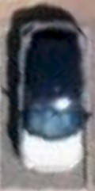

# Parking Slot Occupancy Detection
Fine-tuned ResNet50 model for binary classification on zoomed in parking slot. 

<br>





This repository contains the training code for fine-tuning the ResNet50 model on the "pklot" dataset that was provided by this [paper]("https://www.researchgate.net/publication/344374111_Real-time_image-based_parking_occupancy_detection_using_deep_learning_-_A_CPU_friendly_MATLAB_tutorial").
Additionally, it houses the trained data, consisting of 1500 images for each class(Occupied/Empty), the model itself,
and a demonstration notebook.

## Prerequisites

Before running the code, ensure that you have the following prerequisites:

- Python 3.9 or higher
- PyTorch library
- TorchVision library

You can install the required libraries using pip:

```shell
pip install -r requirements.txt
```

## For demo run `demo.ipynb` file.